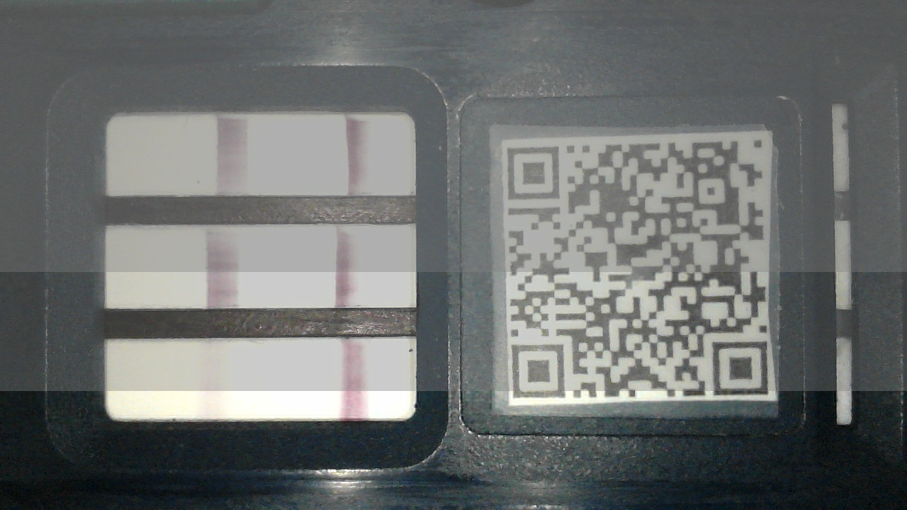
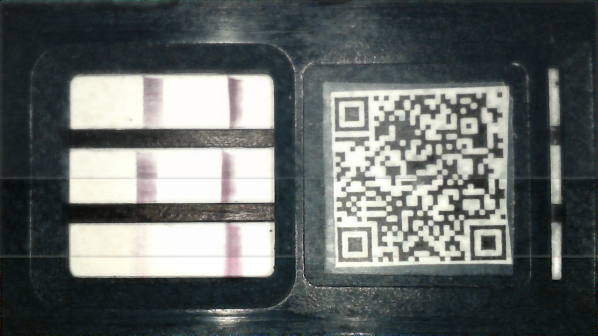

##  [FFA-Net: Feature Fusion Attention Network for Single Image Dehazing](https://arxiv.org/abs/1911.07559) (AAAI 2020)
 Official implementation.

---

### Citation
https://github.com/zhilin007/FFA-Net

### Dependencies and Installation

* python3
* PyTorch>=1.0
* NVIDIA GPU+CUDA
* numpy
* matplotlib
* tensorboardX(optional)

### Datasets Preparation

Dataset website:[RESIDE](https://sites.google.com/view/reside-dehaze-datasets/) ; Paper arXiv version:[[RESIDE: A Benchmark for Single Image Dehazing](https://www.google.com/url?q=https%3A%2F%2Farxiv.org%2Fpdf%2F1712.04143.pdf&sa=D&sntz=1&usg=AFQjCNHzdt3kMDsvuJ7Ef6R4ev59OFeRYA)]

<details>
<summary> FILE STRUCTURE </summary>

```
    FFA-Net
    |-- README.md
    |-- net
    |-- data
        |-- white_data
            |-- train
                |-- hazy
                    |-- *.jpg
                |-- clear
                    |-- *.jpg
            |-- val
                |-- hazy
                    |-- *.jpg
                |-- clear
                    |-- *.jpg
            |-- test
                |-- hazy
                    |-- *.jpg
                |-- clear
                    |-- *.jpg 
        |-- RESIDE
            |-- ITS
                |-- hazy
                    |-- *.png
                |-- clear
                    |-- *.png
            |-- OTS 
                |-- hazy
                    |-- *.jpg
                |-- clear
                    |-- *.jpg
            |-- SOTS
                |-- indoor
                    |-- hazy
                        |-- *.png
                    |-- clear
                        |-- *.png
                |-- outdoor
                    |-- hazy
                        |-- *.jpg
                    |-- clear
                        |-- *.png
```
</details>


### Metrics update
|Methods|Indoor(PSNR/SSIM)|Outdoor(PSNR/SSIM)|
|-|-|-|
|DCP|16.62/0.8179|19.13/0.8148|
|AOD-Net|19.06/0.8504|20.29/0.8765|
|DehazeNet|21.14/0.8472|22.46/0.8514|
|GFN|22.30/0.8800|21.55/0.8444|
|GCANet|30.23/0.9800|-/-|
|FFANet|36.39/0.9886|33.57/0.9840|
### Usage

#### Train

*Remove annotation from [main.py](net/main.py) if you want to use `tensorboard` or view `intermediate predictions`*

*If you have more computing resources, expanding `bs`, `crop_size`, `gps`, `blocks` will lead to better results*

train network on `white data` dataset

 ```shell
 python main.py --net='ffa' --crop --crop_size=540 --blocks=19 --gps=3 --bs=1 --lr=0.0001 --trainset='drug_train' --testset='drug_test' --steps=5000 --eval_step=1000 --device='cuda'
 
 ```
 
train network on `ITS` dataset

 ```shell
 python main.py --net='ffa' --crop --crop_size=240 --blocks=19 --gps=3 --bs=2 --lr=0.0001 --trainset='its_train' --testset='its_test' --steps=500000 --eval_step=5000
 ```


train network on `OTS` dataset


 ```shell
 python main.py --net='ffa' --crop --crop_size=240 --blocks=19 --gps=3 --bs=2 --lr=0.0001 --trainset='ots_train' --testset='ots_test' --steps=1000000 --eval_step=5000
 ```


#### Test

Trained_models are available at baidudrive: https://pan.baidu.com/s/1-pgSXN6-NXLzmTp21L_qIg with code: `4gat`

or google drive: https://drive.google.com/drive/folders/19_lSUPrpLDZl9AyewhHBsHidZEpTMIV5?usp=sharing
*Put  models in the `net/trained_models/`folder.*

*Put your images in `net/test_imgs/`*

test on `white data` dataset

 ```shell
 python test.py --task='drug' --test_imgs='test_imgs'
```

test on `OTS` or `ITS` dataset

 ```shell
 python test.py --task='its or ots' --test_imgs='test_imgs'
```

#### Samples

<p align='center'>
 

</div>


